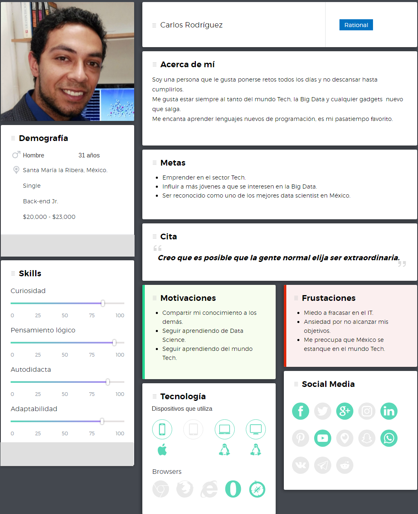

# Challenge Talent Fest

#### El reto consiste en desarrollar la plataforma de The Data Pub (Datank) para llegar a más usuarios y consolidar su identidad.
___
__The Data Pub es una ONG con +1800 miembros, y reuniones mensuales de +120 personas,que lucha porque México se convierta en un polo de talento en Ciencia de Datos y MachineLearning desde el punto de vista de rigor matemático, marco ético, y sin fetichismo tecnológicos. Del lado del talent pool mexicano, estamos en contra de que el Aprendizaje Automático se haga solo descargando paquetes y ejecutando ejemplos. Del lado de las empresas, estamos en contra de la confusión al momento de reclutar científicos de datos y especialistas en machine learning, donde frecuentemente se necesitan Ingenieros de Datos, no Científicos de Datos.__

The Data Pub agrupa el gremio de Ciencia de Datos de México, y como tal, está compuesto de
matemáticos, actuarios y físicos, es decir, profesionales de las ciencias duras. Tenemos pocos
ingenieros y programadores, y por tanto no podemos depender de nuestra comunidad para
desarrollar nuestra plataforma en un esquema de voluntariado.
Para The Data Pub es importante tener una plataforma pública para maximizar el reach de su
audiencia, y efectuar este cambio que México necesita. México produce 113 mil programadores
al año. Cada uno de ellos pretende ser Científico de Datos con una formación matemática
paupérrima, cosa que es imposible e indeseable. Por el contrario, solo producimos 350
matemáticos y físicos, quienes son insuficientes para que México profesionalice su oferta. Si no
balanceamos el talent pool del país, sucederá como ocurrió con el desarrollo de software
empresarial mexicano en 2004, cuando las empresas grandes se llevaron sus proyectos a
India, con resultados desastrosos, debido a que el país incrementaba sus costos de desarrollo
de software, sin incrementar su nivel de skill.

¿Dónde puedo ver más de esta ONG?  
En meetup.com: https://meetup.com/thedatapub  
En FB: https://facebook.com/thedatapub  
En TW: https://twitter.com/thedatapub

Sobre el sitio a desarrollar y sus requerimientos:

El User Stories cuenta con desgloce de implementaciones que puede ser chequeadas en https://mail.google.com/mail/u/0/#label/Laboratoria/162f328dac159be?projector=1&messagePartId=0.1

Se entregó un [PDF](https://drive.google.com/file/d/1h-mDQYDa2oW7EZ_3rpJ4NNmXwvfXvsJ/view) que contiene los logos oficiales del Data Pub. (Están bajo derecho de autor)

## __UX__

### Investigación

Se analizaron los sitios oficiales de la comunidad para obtener toda información y datos duros de la siguiente investigación. Todo esta respandado en cada comentario, en cada usuario y en cada vista.

Empezaremos por definir sus badges de la comunidad:

El __Data Engineer__ se dedica a aportar orden en el caos absoluto de lo datos no estructurados, es decir, desarrolla, construye, prueba y mantiene arquitecturas de almacenamiento y gestión de los mismos.

El __Data Scientist__ no participa en el proceso de adquisición y administración de datos, él se dedicará a desarrollar sofisticados programas analíticos y sistemas de aprendizaje automático (Machine Learning y Deep Learning).

El __Data Artist__ es un analista de negocio especialista en crear gráficos, diagramas, infografías y otros instrumentos visuales que ayuden al ojo humano a comprender datos complejos.
La visualización de datos tiene dos propósitos generales: reducir los datos, son los gráficos de resumen adecuados para los informes anuales o bien, revela+ datos, que son aquellos gráficos que muestran algo que nunca se ha visto antes.

#### Competencia directa:

+ http://www.recluit.com/
+ https://www.tecnoempleo.com/
+ https://www.lawebdelprogramador.com/trabajo/
+ https://www.ticjob.es/
+ https://es.informaticos.trabajar.com

En resumen se detectó que la mayoría de las páginas cuentan con un perfil para empresas y otro para interesados en alguna vacante. También que sus propuestas de valor van desde empleo a nivel mundial, foros, bibliotecas, cursos, etcétera.

Y nuestra propuesta de valor para la optimización del sitio de__"The Data Pub"__ es una comunidad que tiene un trayectoria de 3 años realizando MeetUp's acerca de temas específicos, tienes perfiles para empresas y buscadores de trabajo, invitar a cualquier usuario a ser parte de sus MeetUp´s y tienen el público interesado puede ser anfitrión de su propio Data Pub en cualquier parte de la República.

#### Design System

Para definir la paleta de color y la tipografía fue necesario basarse en los escudos que representan cada uno de sus Badges y depurarlos por colores principales y secundarios para implementarlo en la identidad del sitio.

#### User Persona

Se creó un User Persona partiendo de la información  recopilada del sitio ofiaial de __"The Data Pub"__, [MeetUp](https://meetup.com/thedatapub) ya que ahí existe una gran comunidad activa que esta involucrada con el tema de Data Science y Machine Learning.

Nuestros Insights para crear el User Persona son:
+ Por cada 20 usuarios que están registrados, sólo 3 son mujeres, ésto representa el 15% de féminas.
+ La edad promedio de los usurios oscila entre los 25 y 35 años y cuentan minímamente con una carrera universitaria y esto representa el 85%
+ Los que están inscritos les gusta y se sientes conformes con el proyecto de __"The Data Pub"__, ya que el 92% de los comentarios expresan satisfacción.

#### Copies

Los copies que se utilizaron, netamente se extrajeron de todas sus redes y sitios de la comunidad:

+ "Comunidad de tragos y datos"
+ "Ayudamos a Compañías y compañeros"
+ "¡Todos son bienvenidos!"
+ "Las cheves, el pan y el queso son un plus"
