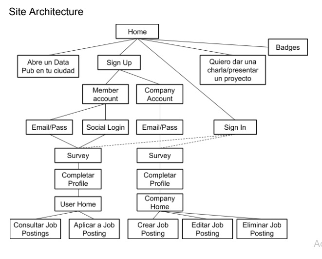
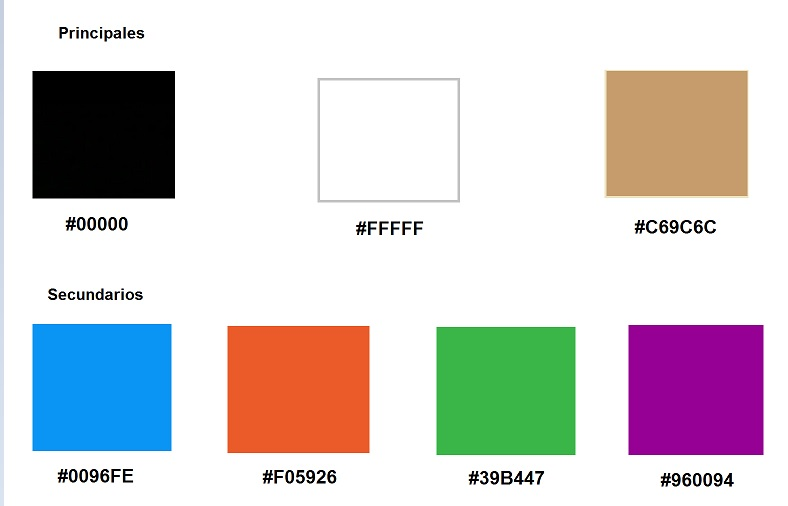
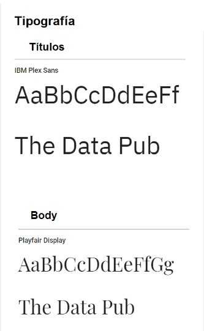

# Challenge Talent Fest
#### Propuesto por The Data Pub como proyecto final para candidatas a graduarse de Laboratoria.
___
__The Data Pub es una ONG con +1800 miembros, y reuniones mensuales de +120 personas,que lucha porque México se convierta en un polo de talento en Ciencia de Datos y MachineLearning desde el punto de vista de rigor matemático, marco ético, y sin fetichismo tecnológicos. Del lado del talent pool mexicano, estamos en contra de que el Aprendizaje Automático se haga solo descargando paquetes y ejecutando ejemplos. Del lado de las empresas, estamos en contra de la confusión al momento de reclutar científicos de datos y especialistas en machine learning, donde frecuentemente se necesitan Ingenieros de Datos, no Científicos de Datos.__

¿Dónde puedo ver más de esta ONG?  
En meetup.com: https://meetup.com/thedatapub  
En FB: https://facebook.com/thedatapub  
En TW: https://twitter.com/thedatapub

Site Architecture

## __UX__

### Investigación

El __Data Engineer__ se dedica a aportar orden en el caos absoluto de lo datos no estructurados, es decir, desarrolla, construye, prueba y mantiene arquitecturas de almacenamiento y gestión de los mismos.

El __Data Scientist__ no participa en el proceso de adquisición y administración de datos, él se dedicará a desarrollar sofisticados programas analíticos y sistemas de aprendizaje automático (Machine Learning y Deep Learning).

El __Data Artist__ es un analista de negocio especialista en crear gráficos, diagramas, infografías y otros instrumentos visuales que ayuden al ojo humano a comprender datos complejos.
La visualización de datos tiene dos propósitos generales: reducir los datos, son los gráficos de resumen adecuados para los informes anuales o bien, revelar datos, que son aquellos gráficos que muestran algo que nunca se ha visto antes.

#### Competencia directa:

+ http://www.recluit.com/
+ https://www.tecnoempleo.com/
+ https://www.lawebdelprogramador.com/trabajo/
+ https://www.ticjob.es/
+ https://es.informaticos.trabajar.com

#### Design System

